# Infraestructura 3 | SR

### Merolyn Mejía Abreu
**Matrícula:** 2025-0827

**Plataforma:** GNS3  
**Firewall:** FortiGate-VM64-KVM  
**Equipo de red:** Cisco R1  
**Configuración de FortiGate:** Interfaz gráfica (GUI)

---

> Laboratorio de Seguridad de Redes orientado a la implementación y validación de una VPN Remote-Site entre un router Cisco R1 y un FortiGate. La infraestructura permite que el equipo de usuarios acceda al servidor web mediante HTTPS sin depender de la VPN, mientras que el acceso administrativo mediante SSH hacia el servidor se realiza a través del túnel IPsec.

---

# 🎥 Video demostrativo

**[Ver video de demostración](https://youtu.be/1YoVov0wePI)**


---

# 🎯 Propósito del laboratorio

El propósito de este laboratorio es implementar una infraestructura de red en GNS3 utilizando un **FortiGate como dispositivo de seguridad** y un **router Cisco R1 como equipo de red**, estableciendo una VPN Remote-Site entre ambos extremos.

La práctica tiene como objetivo comprobar dos comportamientos principales:

1. El equipo de usuarios puede acceder al **servidor web mediante HTTPS sin necesidad de utilizar la VPN**.
2. El equipo de usuarios puede acceder al **servidor mediante SSH utilizando la VPN Remote-Site**.

Para lograrlo, se configuraron las redes de usuarios y servidores, direccionamiento IPv4, DHCP para los usuarios, conectividad mediante un segmento que representa el ISP, publicación del servicio HTTPS y un túnel IPsec para transportar el tráfico SSH.

La validación no se limita a comprobar que el túnel aparece activo. También se verificó desde R1 el estado de ISAKMP y las asociaciones IPsec para comprobar que realmente existió tráfico procesado mediante el túnel.

---

# 📑 Tabla de contenido

1. [Requisitos de la práctica](#1-requisitos-de-la-práctica)
2. [Objetivos de seguridad](#2-objetivos-de-seguridad)
3. [Topología de red](#3-topología-de-red)
4. [Tabla de direccionamiento](#4-tabla-de-direccionamiento)
5. [Funcionamiento de la infraestructura](#5-funcionamiento-de-la-infraestructura)
6. [Configuraciones implementadas](#6-configuraciones-implementadas)
7. [VPN Remote-Site](#7-vpn-remote-site)
8. [Servicios del servidor](#8-servicios-del-servidor)
9. [Políticas y control de acceso](#9-políticas-y-control-de-acceso)
10. [Validación y pruebas](#10-validación-y-pruebas)
11. [Diagramas y evidencias](#11-diagramas-y-evidencias)
12. [Running Configurations](#12-running-configurations)
13. [Scripts y comandos utilizados](#13-scripts-y-comandos-utilizados)
14. [Conclusión](#14-conclusión)

---

# 1. Requisitos de la práctica

La infraestructura fue implementada tomando como base los requisitos establecidos para el laboratorio lo cuales tenian como objetivo implementar una infraestructura donde el usuario pueda acceder al servidor web mediante HTTPS sin necesidad de utilizar una VPN y, al mismo tiempo, pueda acceder al servidor mediante SSH a través de una VPN Remote-Site. Para esto, se utiliza un FortiGate, cuya configuración y demostración debe realizarse completamente mediante la interfaz gráfica (GUI), encargado de las configuraciones de red y de la VPN; además de un equipo de red, preferiblemente Cisco, encargado de proporcionar conectividad. La infraestructura incluye un ISP con direcciones IP públicas, un servidor web en una red /28 con los servicios HTTPS y SSH, y una red de usuarios /25, identificada como VLAN 10, que utiliza DHCP para la asignación de direcciones y desde la cual se realiza un traceroute hacia el servidor para comprobar el recorrido del tráfico.

## Objetivos principales

- El usuario podrá acceder al servidor web sin necesidad de VPN.
- El usuario podrá acceder al servidor mediante SSH vía VPN.

## FortiGate

Se utilizó un **FortiGate-VM64-KVM** como dispositivo principal de seguridad.

En este dispositivo se realizaron:

- Configuraciones de red.
- Configuración de interfaces.
- Rutas.
- Objetos de red.
- Virtual IP para el servidor web.
- Políticas de firewall.
- VPN Remote-Site.
- Phase 1 y Phase 2 de IPsec.

La configuración y demostración del FortiGate se realizó mediante su **interfaz gráfica (GUI)**.

## Equipo de red

Como equipo de red del lado de usuarios se utilizó un:

**Cisco R1**

Este router proporciona conectividad al segmento de usuarios y participa como uno de los extremos de la VPN.

## ISP

Se utilizó un segmento intermedio para representar la comunicación externa o ISP entre R1 y FortiGate.

La red utilizada fue:

`192.168.42.0/24`

## Servidor Web

El servidor Ubuntu pertenece a una red `/28` y proporciona:

- Servicio Web mediante HTTPS.
- Servicio SSH.

## Usuarios

La red de usuarios utiliza:

- Red `/25`.
- VLAN 10.
- DHCP.
- Traceroute para validación de conectividad.

---

# 2. Objetivos de seguridad

La práctica busca demostrar una separación clara entre el acceso web y el acceso administrativo al servidor.

| Acceso | Requisito | Resultado |
|---|---|---|
| Usuario → Web Server | HTTPS sin VPN | Exitoso |
| Usuario → Web Server | Traceroute | Exitoso |
| Usuario → Servidor | SSH mediante VPN | Exitoso |
| VPN Remote-Site | Túnel IPsec activo | Up |
| ISAKMP | Asociación establecida | QM_IDLE / ACTIVE |
| IPsec | Tráfico protegido | Verificado |

El punto principal consiste en demostrar que **el acceso web no depende de la VPN**, mientras que el tráfico SSH hacia el servidor utiliza el túnel IPsec configurado entre R1 y FortiGate.

---

# 3. Topología de red

La infraestructura fue implementada en **GNS3** y está compuesta por:

- **Cisco R1:** equipo de red del lado de usuarios.
- **FortiGate:** dispositivo de seguridad y terminación de la VPN.
- **Windows:** equipo perteneciente a la red de usuarios.
- **Ubuntu Server:** servidor Web y SSH.
- **Segmento ISP:** comunicación entre R1 y FortiGate.
- **VPN Remote-Site:** túnel IPsec entre ambos extremos.

## Diagrama de la topología

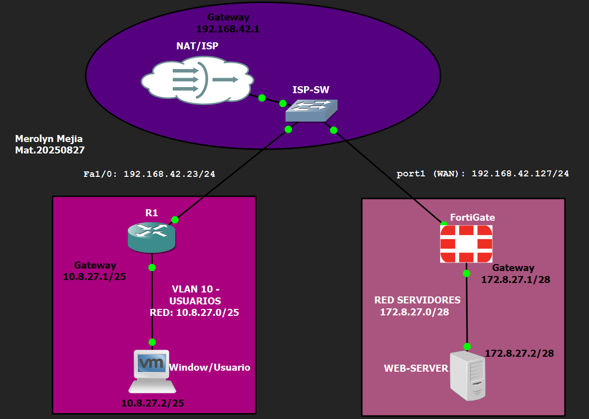

La topología permite observar claramente el recorrido de la comunicación desde el equipo Windows hacia R1, el segmento ISP, FortiGate y finalmente el servidor Ubuntu.

---

# 4. Tabla de direccionamiento

La infraestructura utiliza una red `/25` para usuarios y una red `/28` para servidores. 

| Dispositivo / Interfaz | Zona | Dirección IP | Prefijo | Gateway | Función |
|---|---|---|---|---|---|
| R1 FastEthernet0/0 | Usuarios | `10.8.27.1` | `/25` | — | Gateway de usuarios |
| Windows | Usuarios / VLAN 10 | `10.8.27.2` | `/25` | `10.8.27.1` | Cliente DHCP |
| R1 FastEthernet1/0 | WAN / ISP | `192.168.42.23` | `/24` | `192.168.42.127` | Conectividad hacia FortiGate |
| FortiGate port1 | WAN / ISP | `192.168.42.127` | `/24` | Según laboratorio | Interfaz WAN |
| FortiGate SERVERS | Servidores | `172.8.27.1` | `/28` | — | Gateway de servidores |
| Ubuntu Server | Servidores | `172.8.27.2` | `/28` | `172.8.27.1` | Web Server + SSH |

El direccionamiento esta basado en la matricula 2025-0827

## Redes utilizadas

| Segmento | Red | Gateway |
|---|---|---|
| Usuarios / VLAN 10 | `10.8.27.0/25` | `10.8.27.1` |
| Servidores | `172.8.27.0/28` | `172.8.27.1` |
| WAN / ISP | `192.168.42.0/24` | Según topología |

> El segmento `192.168.42.0/24` representa la red intermedia utilizada como ISP dentro del entorno virtual del laboratorio.

---

# 5. Funcionamiento de la infraestructura

## 5.1 Red de usuarios

El equipo Windows pertenece a:

`10.8.27.0/25`

R1 utiliza:

`10.8.27.1/25`

como gateway de la red y proporciona direccionamiento mediante DHCP.

### Direccionamiento de R1

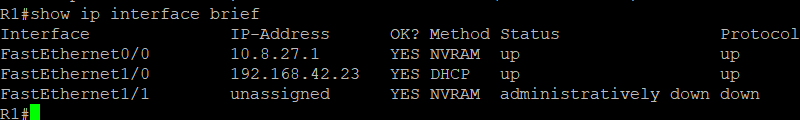

La imagen anterior muestra las interfaces activas de R1 y las direcciones correspondientes a la LAN de usuarios y al segmento WAN.

### DHCP configurado en R1

Para comprobar la asignación se utilizó:

```text
show ip dhcp binding
```

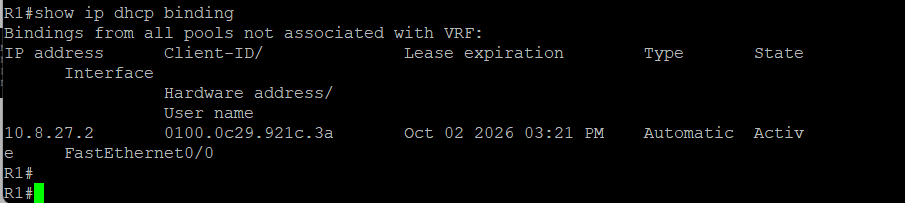

La dirección `10.8.27.2` aparece asignada en estado **Active**.

### Configuración obtenida por Windows

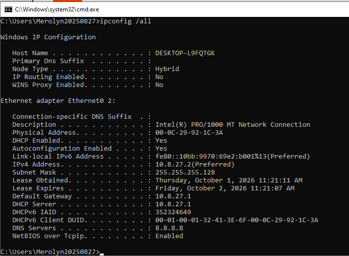

La captura confirma que Windows recibió mediante DHCP:

```text
IP:      10.8.27.2
Máscara: 255.255.255.128
Gateway: 10.8.27.1
```

---

## 5.2 Red de servidores

El servidor Ubuntu utiliza:

```text
IP:      172.8.27.2/28
Gateway: 172.8.27.1
```

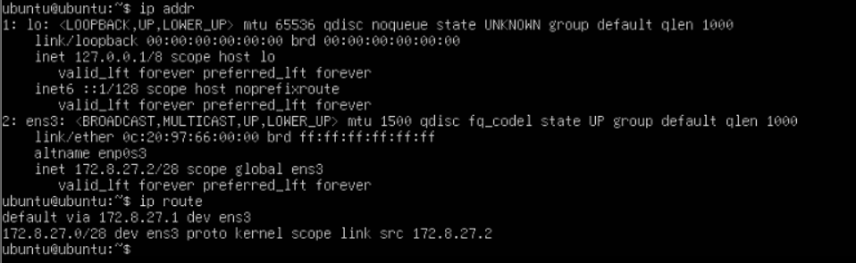

La interfaz del FortiGate correspondiente a servidores utiliza `172.8.27.1/28` y funciona como gateway del Ubuntu Server.

---

## 5.3 Comunicación entre segmentos

R1 posee una ruta hacia:

```text
172.8.27.0/28
```

utilizando como siguiente salto:

```text
192.168.42.127
```

Esto permite que R1 pueda alcanzar el segmento de servidores a través del FortiGate.

---

## 5.4 Acceso Web

El acceso al Web Server se realiza mediante HTTPS.

FortiGate recibe la conexión en su interfaz WAN y utiliza un **Virtual IP (VIP)** para redirigir la conexión hacia el servidor Ubuntu.

Este acceso funciona de manera independiente a la VPN.

---

## 5.5 Acceso SSH

El acceso SSH hacia:

`172.8.27.2`

es el tráfico seleccionado para ser protegido mediante el túnel IPsec.

En R1 se utiliza la siguiente ACL:

```text
permit tcp 10.8.27.0 0.0.0.127 172.8.27.0 0.0.0.15 eq 22
```

De esta forma, el tráfico TCP/22 entre la red de usuarios y el servidor es identificado como tráfico de interés para la VPN.

---

# 6. Configuraciones implementadas

## 6.1 Cisco R1

En R1 se implementaron:

- Interfaz LAN para usuarios.
- Dirección `10.8.27.1/25`.
- DHCP.
- Interfaz WAN.
- NAT.
- Ruta hacia `172.8.27.0/28`.
- IKE/ISAKMP.
- Pre-Shared Key.
- Transform Set IPsec.
- ACL 110.
- Crypto Map.
- Aplicación del Crypto Map sobre la interfaz WAN.

### Interfaz de usuarios

```text
interface FastEthernet0/0
 description LAN-USUARIOS-VLAN10
 ip address 10.8.27.1 255.255.255.128
 ip nat inside
```

---

## 6.2 FortiGate

Las interfaces principales del FortiGate fueron configuradas desde la GUI.

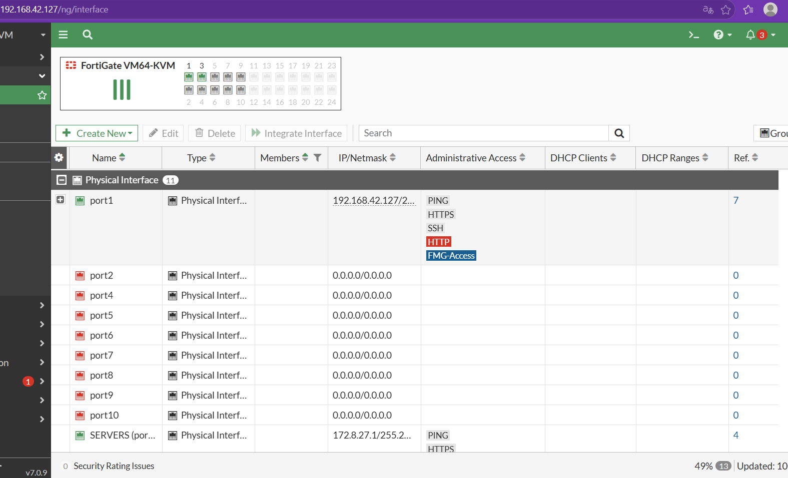

La interfaz WAN `port1` utiliza:

`192.168.42.127/24`

La interfaz correspondiente a la red de servidores utiliza:

`172.8.27.1/28`

### Ruta hacia usuarios

FortiGate posee una ruta hacia:

`10.8.27.0/25`

utilizando:

`192.168.42.23`

como gateway.

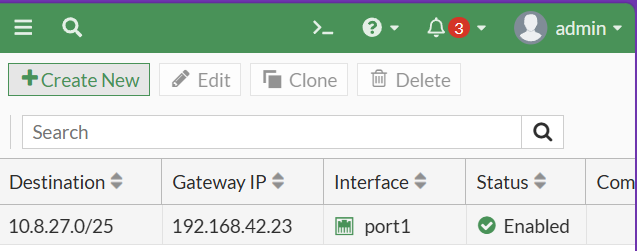

---

## 6.3 Virtual IP del Web Server

Para permitir el acceso HTTPS al servidor se configuró el objeto:

`VIP-WEB-HTTPS`

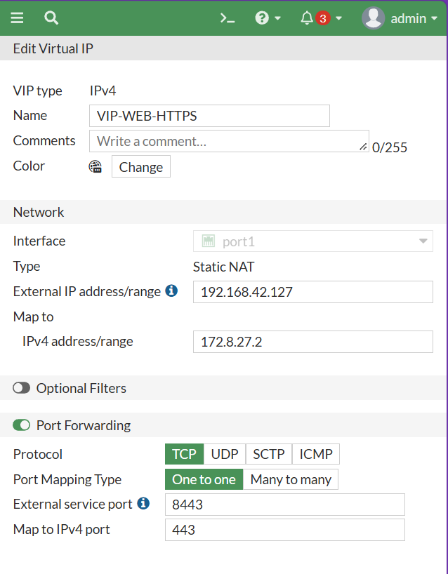

La configuración relaciona la interfaz WAN del FortiGate con el servidor:

`172.8.27.2`

y realiza el Port Forwarding necesario para el servicio HTTPS.

---

## 6.4 Política de acceso Web

Se creó la política:

`WAN-TO-WEB-HTTPS`

para permitir el acceso hacia el servidor web.

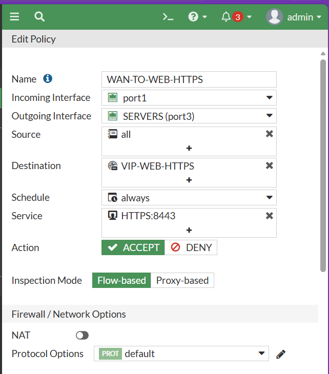

La política utiliza como destino el objeto `VIP-WEB-HTTPS` y permite el servicio HTTPS configurado para la práctica.

---

# 7. VPN Remote-Site

## 7.1 Propósito

La VPN Remote-Site permite transportar de manera protegida el tráfico SSH entre la red de usuarios y la red del servidor.

La conexión se establece entre:

```text
Cisco R1
192.168.42.23
      │
      │ IPsec
      │
FortiGate
192.168.42.127
```

---

## 7.2 Configuración en FortiGate

La VPN fue creada mediante la interfaz gráfica del FortiGate utilizando el asistente de VPN.

**Nombre:**

`VPN-REMOTE-SITE`

**Gateway remoto:**

`192.168.42.23`

**Interfaz:**

`port1`

**Método de autenticación:**

`Pre-shared Key`

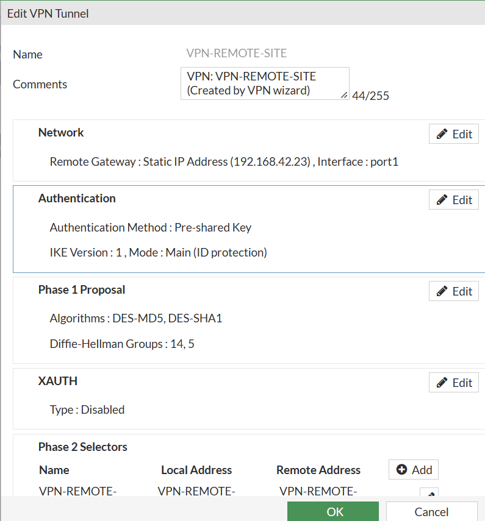

> Por seguridad, la clave precompartida utilizada en el laboratorio no se publica en el repositorio.

---

## 7.3 Phase 1

La Phase 1 permite establecer la negociación inicial IKE entre R1 y FortiGate.

En la configuración del túnel se utilizaron los parámetros establecidos durante la práctica, incluyendo algoritmos de cifrado y hash, grupos Diffie-Hellman y autenticación mediante Pre-Shared Key.

---

## 7.4 Phase 2

La Phase 2 define el tráfico que debe ser protegido mediante IPsec.

En R1 se utilizó la ACL 110:

```text
Extended IP access list 110
10 permit tcp 10.8.27.0 0.0.0.127 172.8.27.0 0.0.0.15 eq 22
```

Por lo tanto:

```text
Origen:  10.8.27.0/25
Destino: 172.8.27.0/28
Servicio: TCP/22 (SSH)
```

---

## 7.5 Estado del túnel

Desde FortiGate se comprobó:

```text
VPN-REMOTE-SITE
Status: Up
```

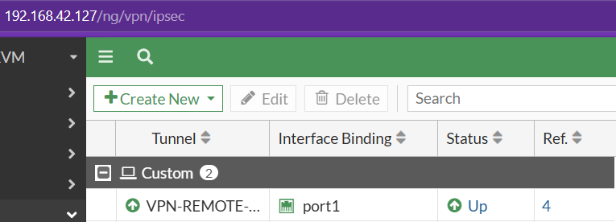

El estado **Up** confirma que el túnel IPsec entre R1 y FortiGate se encuentra establecido.

---

# 8. Servicios del servidor

El servidor Ubuntu utiliza:

```text
IP:      172.8.27.2/28
Gateway: 172.8.27.1
```

## 8.1 Servicio Web

Para comprobar Apache se utilizó:

```bash
systemctl is-active apache2
```

Resultado:

```text
active
```

## 8.2 Servicio SSH

Para comprobar SSH se utilizó:

```bash
systemctl is-active ssh
```

Resultado:

```text
active
```

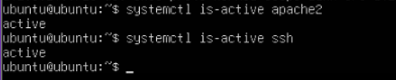

La evidencia confirma que tanto **Apache2 como SSH se encuentran activos** en el Ubuntu Server.

---

# 9. Políticas y control de acceso

La infraestructura diferencia el acceso público al servicio web del tráfico administrativo protegido mediante VPN.

| Tráfico | Función | Resultado |
|---|---|---|
| Usuario → Web Server / HTTPS | Acceso web | Permitido sin VPN |
| Usuario → Web Server / SSH | Administración | Protegido mediante VPN |
| Usuario → Servidor / ICMP | Conectividad | Verificado |
| Usuario → Servidor / Traceroute | Verificación de ruta | Verificado |

El acceso HTTPS no depende del túnel VPN. En cambio, el tráfico SSH es seleccionado como tráfico de interés para IPsec.

---

# 10. Validación y pruebas

## 10.1 Validación del DHCP

En R1 se ejecutó:

```text
show ip dhcp binding
```

Resultado:

```text
10.8.27.2
Estado: Active
```


**Resultado:** DHCP funcionando correctamente.

---

## 10.2 Validación del servidor

Desde Ubuntu se utilizaron:

```bash
ip addr
ip route
```

Se comprobó:

```text
IP:      172.8.27.2/28
Gateway: 172.8.27.1
```


**Resultado:** Direccionamiento del servidor verificado.

---

## 10.3 Acceso Web sin VPN

Desde Windows se accedió al Web Server mediante HTTPS.

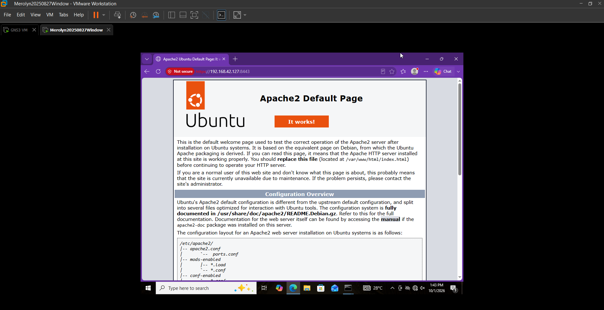

La visualización de la página de Apache permite comprobar que:

- El usuario posee conectividad.
- El servidor web se encuentra disponible.
- El servicio web funciona.
- El acceso web no depende de la VPN.

**Resultado:** Exitoso.

---

## 10.4 Traceroute Usuario → Web Server

Desde Windows se ejecutó:

```text
tracert -d 172.8.27.2
```

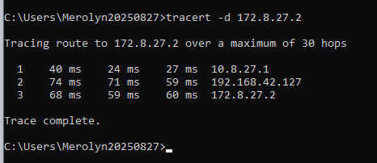

El recorrido observado fue:

```text
1 → 10.8.27.1
2 → 192.168.42.127
3 → 172.8.27.2
```

Esto demuestra el recorrido del tráfico desde el equipo de usuarios hasta el servidor.

**Resultado:** Exitoso.

---

## 10.5 Estado de la VPN

Desde la interfaz gráfica del FortiGate se comprobó el estado de:

`VPN-REMOTE-SITE`


El túnel aparece en estado:

`Up`

**Resultado:** Túnel establecido.

---

## 10.6 Acceso SSH mediante VPN

Desde Windows se realizó la conexión:

```bash
ssh ubuntu@172.8.27.2
```

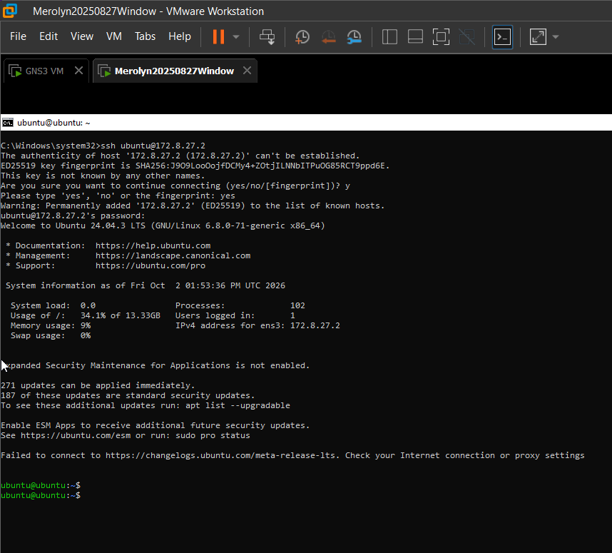

La conexión permitió iniciar sesión correctamente en Ubuntu.

```text
ubuntu@ubuntu:~$
```

Esta prueba demuestra que el usuario puede acceder al servidor mediante SSH utilizando la VPN.

**Resultado:** Exitoso.

---

## 10.7 Validación de ISAKMP

En R1 se ejecutó:

```text
show crypto isakmp sa
```

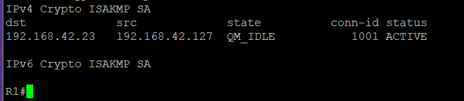

Se observó:

```text
QM_IDLE
ACTIVE
```

El estado `QM_IDLE` permite comprobar que la asociación IKE/ISAKMP se encuentra establecida.

**Resultado:** Asociación establecida.

---

## 10.8 Validación de IPsec

Finalmente, en R1 se utilizó:

```text
show crypto ipsec sa
```

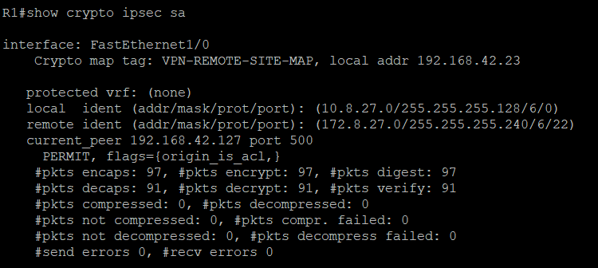

Los contadores mostrados permiten comprobar la existencia de paquetes:

- Encapsulados.
- Cifrados.
- Desencapsulados.
- Descifrados.

Esto demuestra que no solamente se estableció el túnel, sino que existió tráfico procesado por las asociaciones IPsec.

**Resultado:** Tráfico IPsec verificado.

---

# 11. Diagramas y evidencias

Todas las evidencias visuales utilizadas en la documentación se encuentran almacenadas en la carpeta:

```text
Imagenes/
```

La organización utilizada es:

```text
Imagenes/
├── image01.png   → Diagrama de la topología
├── image02.png   → Direccionamiento de R1
├── image03.png   → DHCP del Usuario
├── image04.png   → Windows: DHCP
├── image05.png   → Web Server: configuración de red
├── image06.png   → Servicios del Web Server
├── image07.png   → FortiGate: interfaces
├── image08.png   → FortiGate: ruta hacia Usuarios
├── image09.png   → VIP del Web Server
├── image10.png   → Política de acceso Web
├── image11.png   → Usuario → Web Server sin VPN
├── image12.png   → Traceroute Usuario → Web Server
├── image13.png   → Configuración VPN Remote-Site
├── image14.png   → VPN Remote-Site: estado Up
├── image15.png   → Usuario → Servidor por SSH mediante VPN
├── image16.png   → R1: VPN IPsec activa
└── image17.png   → R1: tráfico cifrado por IPsec
```

---

# 12. Running Configurations

Las configuraciones utilizadas durante el laboratorio estan en:

```text
RUNNING-CONFIGS/
```

## Cisco R1

R1 contiene las configuraciones relacionadas con:

- Interfaces.
- DHCP.
- NAT.
- Ruta hacia servidores.
- IKE/ISAKMP.
- Transform Set.
- ACL 110.
- Crypto Map.
- Asociación del Crypto Map a la interfaz WAN.

## FortiGate

El archivo correspondiente al FortiGate debe incluir:

- Interfaces.
- Direccionamiento.
- Ruta hacia usuarios.
- Objetos de dirección.
- VIP del Web Server.
- Políticas de firewall.
- VPN Phase 1.
- VPN Phase 2.
- Rutas relacionadas con la VPN.

---

# 13. Scripts y comandos utilizados

Durante esta práctica no se utilizaron scripts automatizados de configuración. 
Los comandos utilizados fueron principalmente comandos de verificación y validación 
de la infraestructura, los cuales se documentan a continuación.

## Cisco R1

```text
show ip interface brief
show ip dhcp binding
show ip route
show crypto isakmp sa
show crypto ipsec sa
```

## Windows

```text
ipconfig /all
tracert -d 172.8.27.2
ssh ubuntu@172.8.27.2
```

## Ubuntu Server

```bash
ip addr
ip route
systemctl is-active apache2
systemctl is-active ssh
```

Estos comandos permitieron validar el direccionamiento, DHCP, rutas, servicios del servidor, conectividad y funcionamiento de la VPN.

---

# 14. Conclusión

Este laboratorio permitió implementar y validar una infraestructura de Seguridad de Redes utilizando **FortiGate, Cisco R1, un equipo Windows y un servidor Ubuntu dentro de GNS3**.

La infraestructura fue configurada para cumplir con los dos objetivos principales de la práctica. Primero, se comprobó que el equipo de usuarios puede acceder al servidor web sin depender del túnel VPN. Posteriormente, se estableció la VPN Remote-Site entre R1 y FortiGate y se comprobó el acceso al servidor mediante SSH utilizando IPsec.

Además de comprobar la conectividad, se realizaron diferentes validaciones para confirmar el funcionamiento de la VPN. El estado `QM_IDLE / ACTIVE` permitió verificar la asociación IKE/ISAKMP, mientras que los contadores mostrados mediante `show crypto ipsec sa` permitieron comprobar que realmente existió tráfico procesado por IPsec.

De esta manera, la práctica permitió comprender de forma aplicada cómo se puede separar el acceso a un servicio web del tráfico administrativo que requiere protección, utilizando **políticas de firewall, rutas, direccionamiento, selectores de tráfico y una VPN IPsec** para controlar y proteger la comunicación entre diferentes segmentos de una infraestructura..
